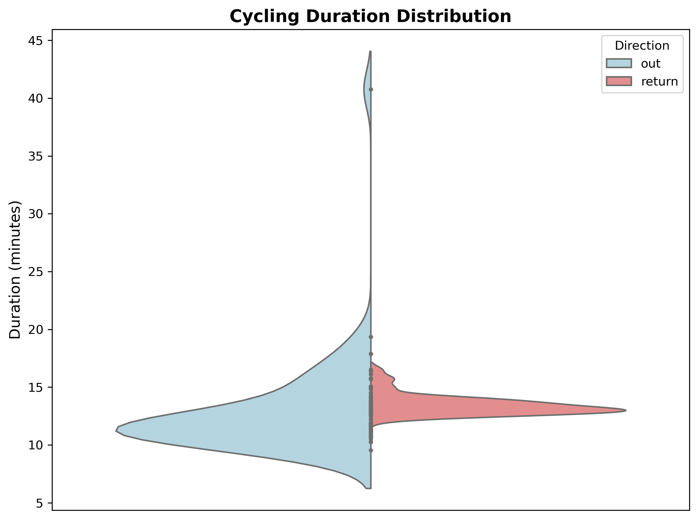
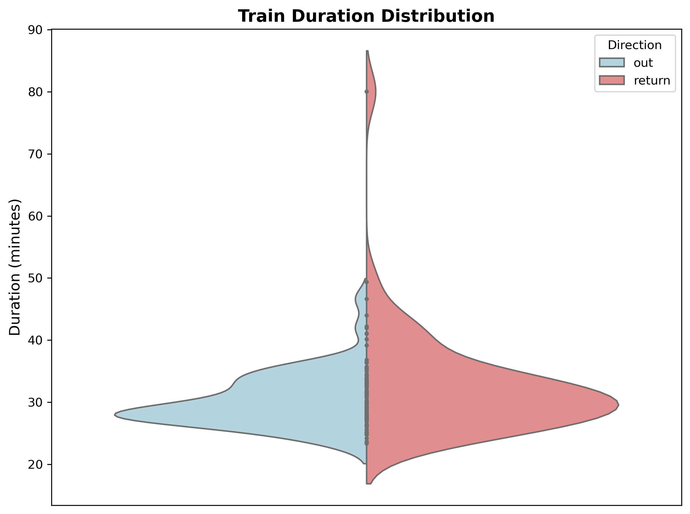
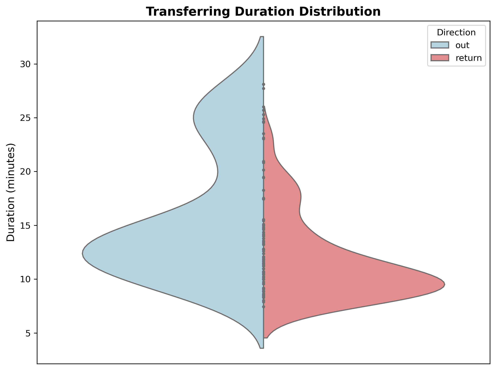
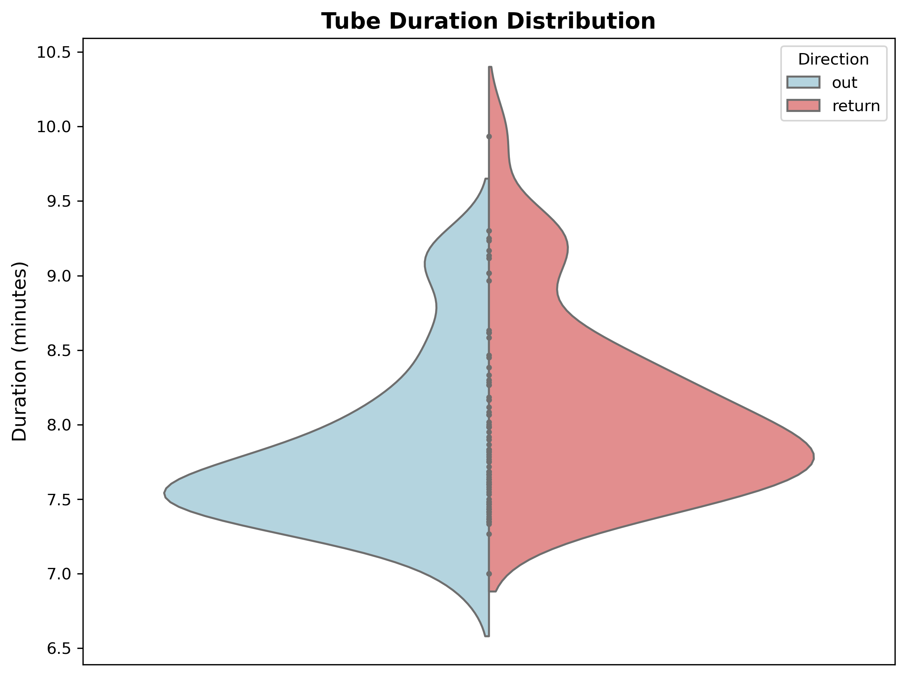
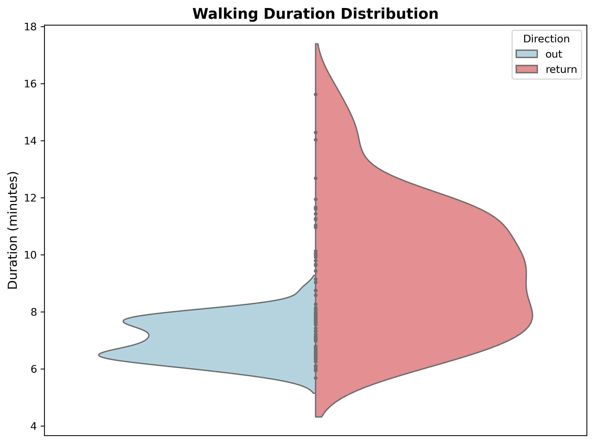
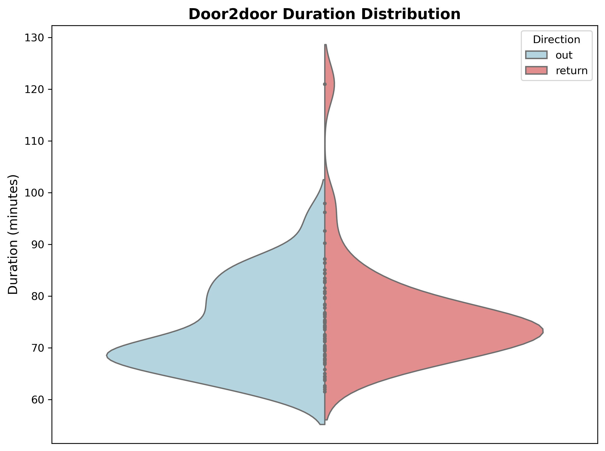
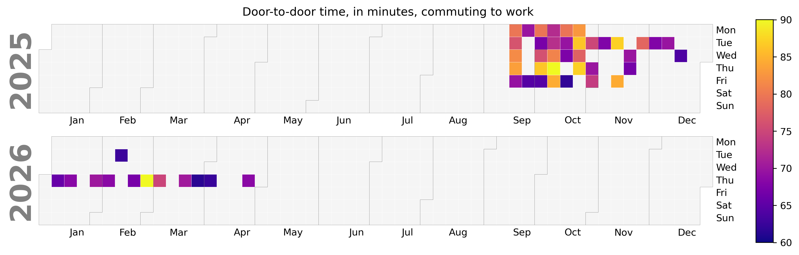
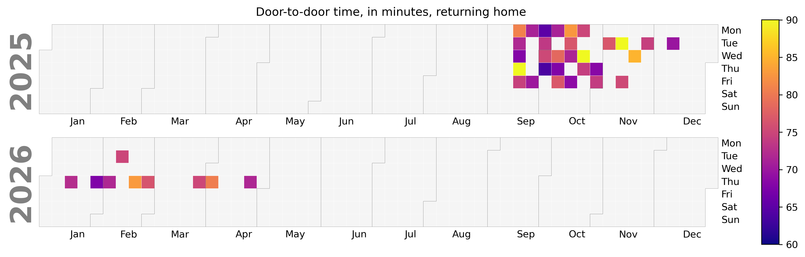

I'm not sure why github is showing different versions to the linked images ... click on the plots to reveal the most up to date version.

## Cycling

## Train

## Transferring

## Tube

## Walking

## Door to door

## Calplot going out

## Calplot returning home

